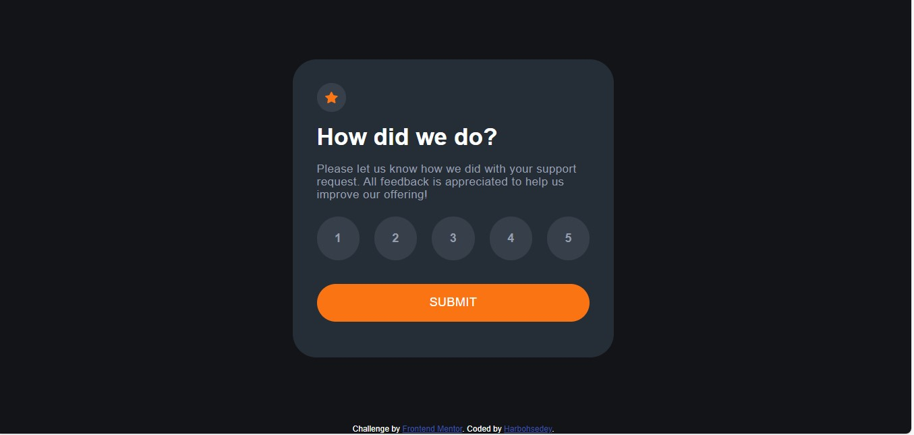

# Frontend Mentor - Interactive rating component solution

This is a solution to the [Interactive rating component challenge on Frontend Mentor](https://www.frontendmentor.io/challenges/interactive-rating-component-koxpeBUmI). Frontend Mentor challenges help you improve your coding skills by building realistic projects.

## Table of contents

- [Overview](#overview)
  - [The challenge](#the-challenge)
  - [Screenshot](#screenshot)
  - [Links](#links)
- [My process](#my-process)
  - [Built with](#built-with)
  - [What I learned](#what-i-learned)
  - [Continued development](#continued-development)
- [Author](#author)

## Overview

### The challenge

Users should be able to:

- View the optimal layout for the app depending on their device's screen size
- See hover states for all interactive elements on the page
- Select and submit a number rating
- See the "Thank you" card state after submitting a rating

### Screenshot

 

### Links

- Solution URL: Repositoty Link (https://github.com/Haleemah-Abosede/interactive-rating-component-main)
- Live Site URL: (https://haleemah-abosede.github.io/interactive-rating-component-main/)

## My process

### Built with

- Semantic HTML5 markup
- CSS custom properties
- Flexbox
- CSS Grid
- Vanilla Javascript

### What I learned

The use of javascript to display sections smoothly and I was finally able to practice the use of .classList and innerText to add class and select values to a card.

To see how you can add code snippets, see below:

```js
const card = e.target;
card.classList.add("checked");
rate = e.target.innerText;
```

### Continued development

I would like to practice more of "e.target" codes because it took me a while to finally get a hang of it.

## Author

- Frontend Mentor - [@Haleemah_Abosede](https://www.frontendmentor.io/profile/Haleemah_Abosede)
- Twitter - [@pharm_Haleemah](https://www.twitter.com/pharm_Haleemah)
